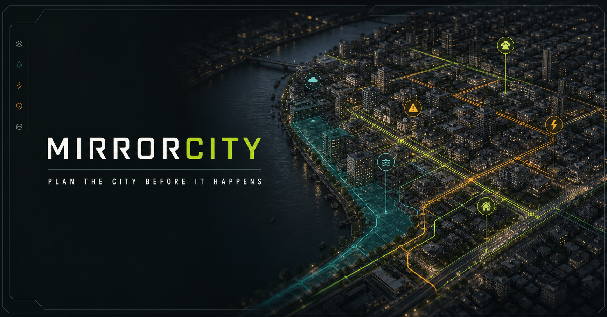
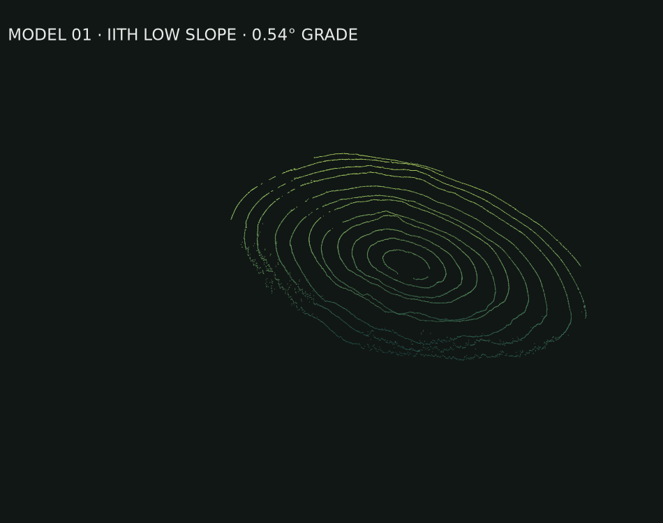
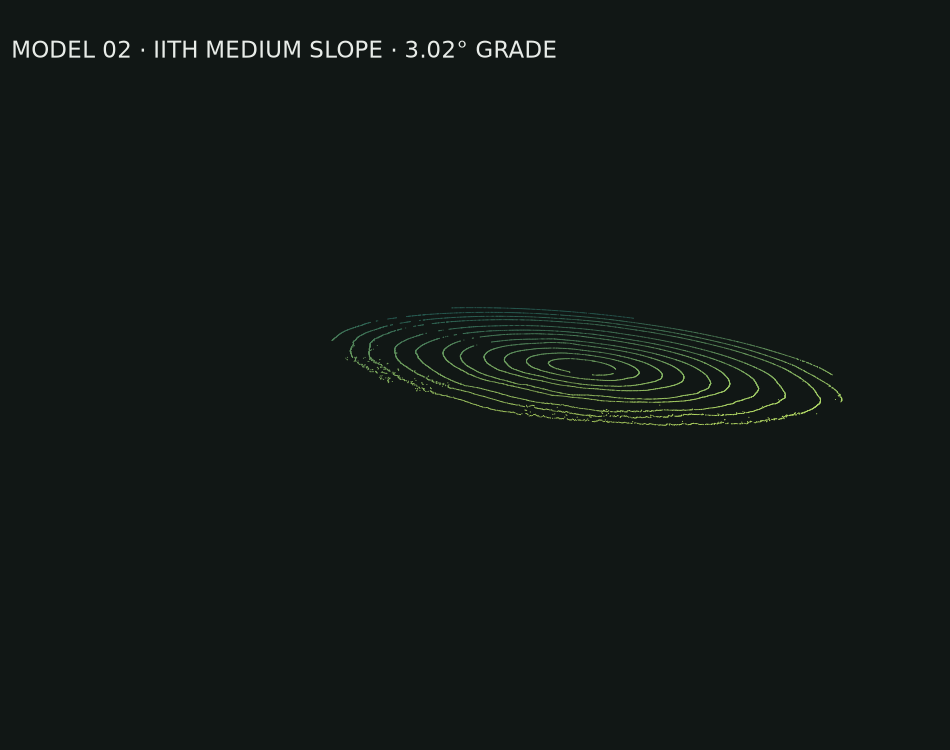
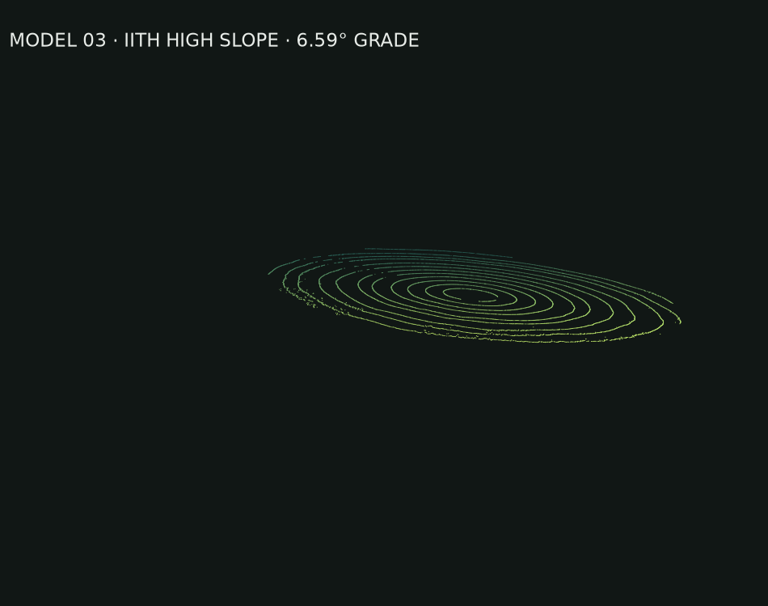
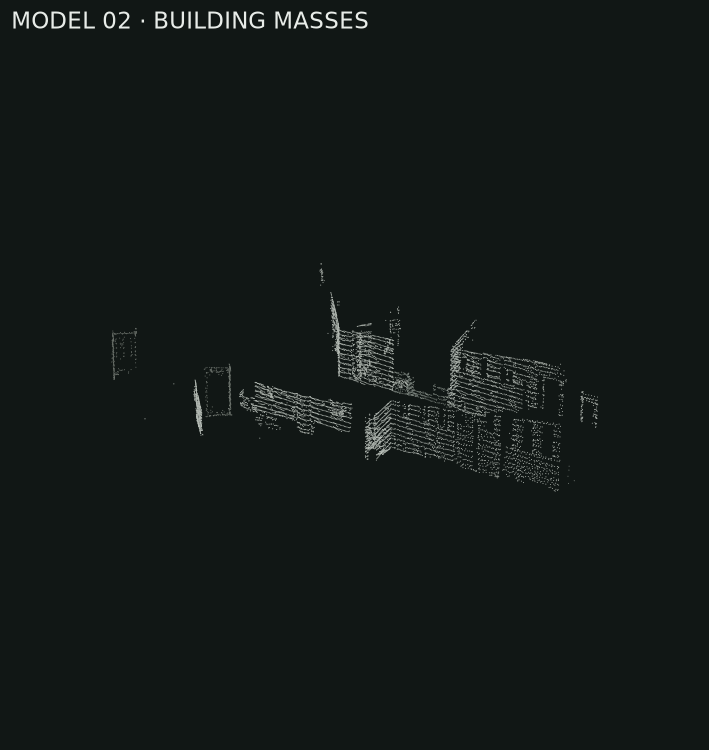
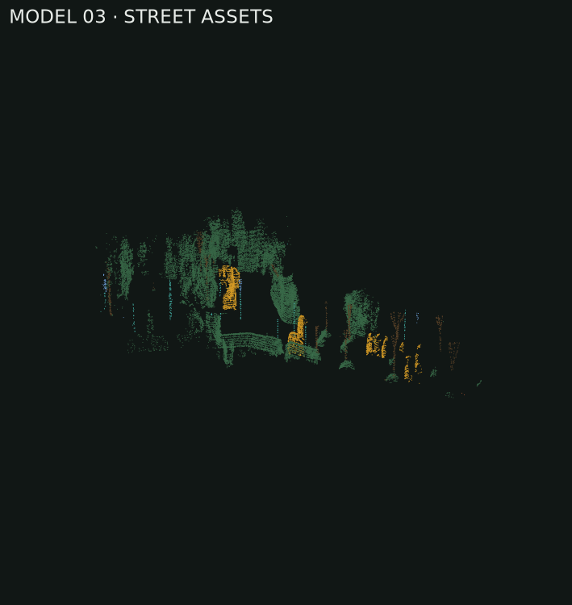
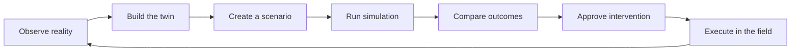
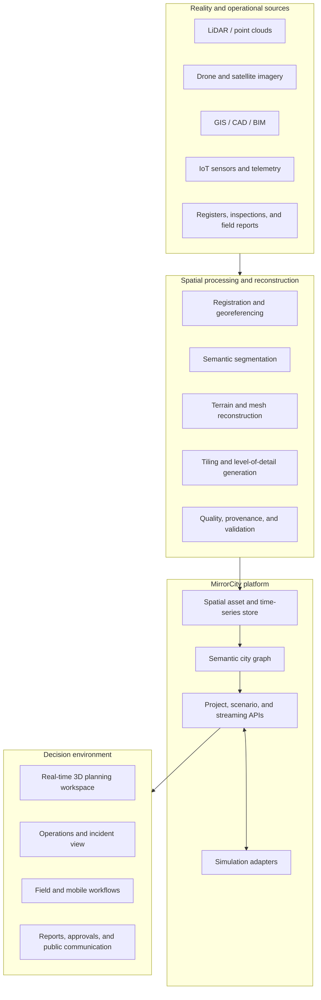

# MirrorCity

<p align="center">
  
</p>

<p align="center">
  <strong>A spatial operating system for understanding, planning, simulating, and protecting the places where people live.</strong>
</p>

<p align="center">
  <a href="#prototype-today">Prototype today</a> ·
  <a href="#the-longer-vision">Longer vision</a> ·
  <a href="#architecture">Architecture</a> ·
  <a href="#roadmap">Roadmap</a> ·
  <a href="#getting-started">Getting started</a>
</p>

<p align="center">
  
  
  
  
  
</p>

---

## The idea

Cities are usually planned through disconnected maps, drawings, spreadsheets, survey files, engineering models, and departmental systems. During an emergency, those boundaries become even more costly: the road network lives in one system, sewer capacity in another, electrical assets in another, and the latest field information may exist only in messages or reports.

**MirrorCity brings those layers into one living 3D environment.**

The goal is to build a district- and city-scale digital twin that begins with LiDAR, imagery, GIS, BIM, sensor, and infrastructure data; turns them into a navigable semantic model; and lets planners ask consequential questions before they become real-world failures.

> What changes if 2,000 people occupy infrastructure designed for 1,500? Where will sewage back up? Which transformer becomes the bottleneck? Which roads remain usable during a flood? Where should a pump, shelter, generator, hospital, or evacuation route be placed?

MirrorCity is intended to make those questions spatial, collaborative, testable, and understandable.

## Prototype today

The current repository is an early, browser-based proof of concept—not yet a production engineering model. It demonstrates the interaction model and technical foundation for the larger platform.

| Capability | What exists now |
| --- | --- |
| **3D city engine** | A real-time Three.js scene with an orbit camera, lighting, shadows, fog, water, roads, buildings, vegetation, traffic, and point-cloud visualization. |
| **LiDAR reconstruction** | Open3D pipelines for filtering labelled points, terrain meshing, semantic clustering, preview generation, and GLB/OBJ/PLY export. |
| **IITH terrain set** | Three browser-ready terrain models reconstructed from low-, medium-, and high-slope labelled captures. |
| **Asset authoring** | Place, select, drag, rotate, scale, nudge, duplicate, replace, delete, inspect, and download civic assets. |
| **Infrastructure authoring** | Draw sewer, power, water, and road corridors; mark planning zones; and place proposed buildings. |
| **Scenario workspace** | Interactive population, sewer-capacity, flood, evacuation, and incident-response demonstrations. |
| **Operational view** | Layer controls, sensor indicators, capital-work status, simulated vehicles, asset health, and an event feed. |
| **Comparison workflow** | Current-versus-proposed district view and scenario snapshots. |

### IITH LiDAR terrain reconstructions

The supplied labelled ground dataset is converted into web-ready geometry using Open3D. Ground and non-ground returns are separated, the terrain is downsampled and triangulated, and each result is exported with its source cloud and metadata.

| Low slope | Medium slope | High slope |
| :---: | :---: | :---: |
|  |  |  |
| **0.54°** fitted grade · 6,953 triangles | **3.02°** fitted grade · 6,932 triangles | **6.59°** fitted grade · 6,904 triangles |

Every terrain capture contains 18,449 labelled points: 17,732 ground points and 717 non-ground points. The complete statistics and generated filenames are recorded in [`public/models/iith/manifest.json`](public/models/iith/manifest.json).

### Additional reconstruction studies

| Road and terrain | Building masses | Street assets |
| :---: | :---: | :---: |
|  |  |  |

These studies explore a future semantic pipeline in which a registered point cloud can be separated into terrain, structures, vegetation, vehicles, poles, signs, and other planning objects.

## The longer vision

MirrorCity should become more than a 3D viewer. The long-term product is a **multi-scale spatial decision platform** that connects physical reality, engineering systems, human activity, and future scenarios.

### 1. Build the city from reality

- Ingest LAS/LAZ, PCD, E57, GeoTIFF, orthophotos, drone imagery, GIS layers, CAD, IFC/BIM, GLB/glTF, and field-survey data.
- Register repeated surveys into a consistent coordinate system.
- Generate terrain, buildings, roads, vegetation, drainage, and object-level geometry.
- Use segmentation and foundation-model-assisted workflows—potentially including SAM-family approaches where technically and legally appropriate—to identify and isolate assets from imagery and point clouds.
- Stream massive areas through levels of detail instead of loading an entire city at once.
- Preserve provenance so every reconstructed object can be traced back to its source survey and processing run.

### 2. Move from geometry to a semantic city

A useful digital twin must understand that an object is not merely a mesh. It should know that it is **Transformer E-14**, that it supplies three blocks, that it was inspected on a particular date, and that its loss affects a hospital and two pump stations.

```text
Region
└── City
    └── District / Ward
        └── Parcel / Campus
            └── Building / Road / Utility network
                └── Floor / Zone / Pipe segment / Feeder
                    └── Room / Equipment / Vehicle / Sensor
                        └── Component / Valve / Cable / Wiring
```

MirrorCity is designed to work across this entire hierarchy—from watershed and city systems down to generators, pumps, panels, cables, pipes, valves, and individual service connections.

### 3. Connect infrastructure as networks

- **Water and sewer:** pipes, inlets, manholes, pumps, treatment plants, flow direction, capacity, blockage, and overflow.
- **Power:** generation, substations, feeders, transformers, backup generators, batteries, solar, and critical loads.
- **Mobility:** roads, junctions, transit, emergency lanes, traffic demand, closures, and evacuation routes.
- **Communications:** towers, fiber, radio coverage, control rooms, and emergency connectivity.
- **Buildings:** occupancy, access, fire systems, elevators, mechanical systems, energy demand, and BIM-linked components.
- **Environment:** elevation, drainage, rivers, flood plains, heat, air quality, vegetation, and land cover.

### 4. Simulate before acting

The intended workflow is not simply “view the map.” It is to create an intervention, run a model, compare outcomes, and make a defensible decision.



Representative scenarios include:

- Population growth from 1,500 to 2,000 or 2,500 residents.
- Sewer surcharge, blockage, backflow, overflow, and treatment-capacity stress.
- Extreme rainfall, river flooding, surface runoff, and pump placement.
- Transformer or feeder failure and backup-power planning for critical facilities.
- Fire spread, hazardous-material isolation, and emergency access.
- Earthquake damage, bridge closure, landslide, or structural-risk assessment.
- Evacuation clearance, shelter capacity, ambulance routing, and road reversals.
- Construction phasing and service disruption before capital works begin.
- Energy, emissions, shade, heat-island, and land-use alternatives.

### 5. Become a shared operating picture

The same environment should support different people without forcing them into the same technical workflow:

- **District administrators** see priorities, risks, approvals, and public outcomes.
- **Urban planners** compare land-use, density, mobility, and infrastructure alternatives.
- **Engineers** inspect networks, assumptions, capacity, and asset-level dependencies.
- **Disaster-management teams** prepare playbooks, inject incidents, and coordinate response.
- **Field teams** receive location-specific tasks and return photos, inspections, and status.
- **Decision-makers and communities** understand proposed changes through clear visual scenarios.

## Product principles

1. **Reality first.** Every decision should remain traceable to surveys, models, observations, or clearly stated assumptions.
2. **Open by design.** Prefer interoperable formats and modular simulation adapters over a closed data silo.
3. **From city to component.** Users should be able to move naturally from a regional risk view to a single cable, pump, room, or valve.
4. **Scenarios, not screenshots.** The twin should support alternatives, time, uncertainty, and consequences.
5. **Government-ready.** Data ownership, auditability, role-based access, offline workflows, and long-lived records are core requirements.
6. **Human-readable.** Complex models should produce explanations and decisions that non-specialists can understand.
7. **Performance is a feature.** Large point clouds and city models must remain streamable on ordinary government hardware and field devices.

## Architecture

The prototype currently runs locally in the browser. The target architecture separates source data, reconstruction, spatial services, simulation engines, and user-facing workflows so each can evolve independently.



### Current technical foundation

| Layer | Current implementation |
| --- | --- |
| Interface | React 19 with a Next.js-compatible App Router structure |
| 3D runtime | Three.js, WebGL, GLTFLoader, OrbitControls, raycasting, dynamic scene objects |
| LiDAR processing | Python, NumPy, SciPy, Open3D, Trimesh, Matplotlib |
| Model formats | GLB, OBJ, mesh PLY, source-cloud PLY, PNG previews, JSON manifests |
| Styling | Responsive application shell with native CSS and Tailwind processing |
| Deployment target | Cloudflare-compatible Vinext build |

## Data-to-decision pipeline


## Roadmap

### Phase 0 — Interactive concept *(current)*

- [x] Real-time browser-based 3D district scene
- [x] IITH point-cloud terrain reconstruction pipeline
- [x] GLB/OBJ/PLY model outputs and previews
- [x] Placeable and editable civic assets
- [x] Utility-line, planning-zone, and proposed-building tools
- [x] Sewer, flood, evacuation, and live-incident demonstrations
- [x] Current-versus-proposed comparison mode

### Phase 1 — Real project ingestion

- [ ] Robust LAS/LAZ/E57/PCD and GeoTIFF ingestion
- [ ] Coordinate-reference-system detection and transformation
- [ ] Survey registration, data-quality reports, and processing jobs
- [ ] Large-area spatial tiling and progressive streaming
- [ ] Object segmentation and human-in-the-loop correction
- [ ] Persistent projects, users, permissions, and version history

### Phase 2 — Engineering-grade twin

- [ ] Semantic asset registry and dependency graph
- [ ] IFC/BIM and GIS synchronization
- [ ] Water, sewer, power, traffic, and flood simulation adapters
- [ ] Calibration against measured sensor and field data
- [ ] Scenario branching, uncertainty, assumptions, and reproducible runs
- [ ] Engineering exports, reports, approvals, and audit logs

### Phase 3 — Disaster and operations platform

- [ ] Real-time telemetry and alert ingestion
- [ ] Incident command, resource staging, and response playbooks
- [ ] Multi-user collaboration and role-specific workspaces
- [ ] Mobile/offline field collection and damage assessment
- [ ] Forecast feeds, early warning, and automated scenario triggers
- [ ] District, state, and national deployment patterns

### Phase 4 — City intelligence ecosystem

- [ ] Cross-city templates and reusable planning standards
- [ ] Secure model marketplace and asset catalogue
- [ ] AI-assisted scenario creation and decision explanation
- [ ] Privacy-preserving population and mobility analysis
- [ ] Public consultation and transparent plan communication
- [ ] Open APIs and a simulation/plugin SDK

## Getting started

### Requirements

- Node.js **22.13 or newer**
- npm
- A modern browser with WebGL support

### Run the application

```bash
git clone https://github.com/SASTxNST/MirrorCity.git
cd MirrorCity
npm install
npm run dev
```

Open [http://localhost:3000](http://localhost:3000).

### Validate a production build

```bash
npm run build
npm run lint
```

## Rebuilding the IITH terrain models

The generated models are already included under `public/models/iith`. To reproduce them from an extracted labelled dataset:

```bash
python -m venv .venv
source .venv/bin/activate
pip install -r scripts/requirements-open3d.txt

python scripts/reconstruct_iith_ground_models.py \
  --dataset /path/to/IITH_LiDAR_ground_dataset_labelled_raw \
  --output public/models/iith
```

The pipeline writes:

- Browser-ready `.glb` geometry
- Editable `.obj` geometry
- Mesh and source-cloud `.ply` files
- Labelled-context point clouds
- `.png` reconstruction previews
- A machine-readable `manifest.json`

## Repository guide

```text
MirrorCity/
├── app/
│   ├── CityEngine.tsx       # Interactive Three.js district runtime
│   ├── ModelViewer.tsx      # Standalone GLB inspection viewer
│   ├── page.tsx             # Product workspace and planning interactions
│   ├── globals.css          # MirrorCity interface and scene overlays
│   └── layout.tsx           # Application metadata and fonts
├── public/
│   ├── og.png               # MirrorCity hero/social artwork
│   └── models/
│       ├── iith/            # IITH terrain models and source bundles
│       └── lidar/           # Semantic reconstruction studies
├── scripts/
│   ├── reconstruct_iith_ground_models.py
│   ├── reconstruct_lidar_models.py
│   └── requirements-open3d.txt
└── README.md
```

## Current limitations

This is deliberately labelled a prototype. The present simulations communicate product behavior but are not yet calibrated hydraulic, electrical, traffic, structural, or emergency-response models. The current city is a procedural demonstration environment, and the imported LiDAR samples represent terrain studies rather than a fully georeferenced city.

Before operational or public-sector use, MirrorCity will require validated engineering solvers, spatial databases, access controls, data-retention policies, cybersecurity review, accessibility testing, deployment hardening, field validation, and clear accountability for every automated recommendation.

## Data responsibility

Urban twins can contain sensitive information about critical infrastructure, buildings, movement, and communities. The production vision therefore includes:

- Government or project-owner control of source data and derived models
- Encryption, least-privilege access, tenant isolation, and complete audit logs
- Explicit retention and deletion policies
- Privacy-preserving aggregation for population and mobility data
- Offline or sovereign deployment options where required
- Dataset, model, and simulation provenance attached to every decision

The IITH archive used for the included terrain studies was supplied for this prototype. Confirm the original dataset terms before redistributing source data or derived assets.

## Contributing

MirrorCity is at the stage where architecture, geospatial processing, simulation design, and field requirements are still being shaped. Contributions are especially valuable in:

- Point-cloud registration, classification, meshing, and 3D tiling
- GIS/BIM interoperability and semantic city models
- Hydraulic, flood, power, traffic, and evacuation simulation
- Three.js rendering, asset streaming, and large-scene performance
- Disaster-management workflows and government deployment requirements
- Security, accessibility, data governance, and offline-first field tools

When proposing a feature, describe the real planning or response decision it enables—not only the interface it adds.

## Project status

MirrorCity is an exploratory prototype under active development. It is not affiliated with Esri, Meta, IITH, or any government organization. References to third-party tools, datasets, or model families describe interoperability or research directions and do not imply endorsement.

---

<p align="center">
  <strong>MirrorCity</strong><br />
  Plan the city before it happens.
</p>
